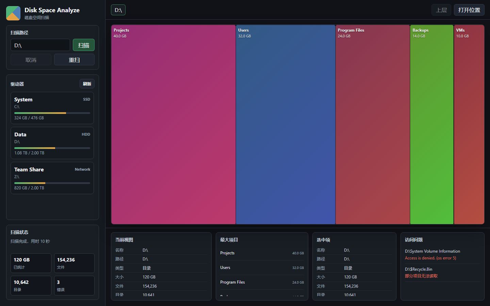
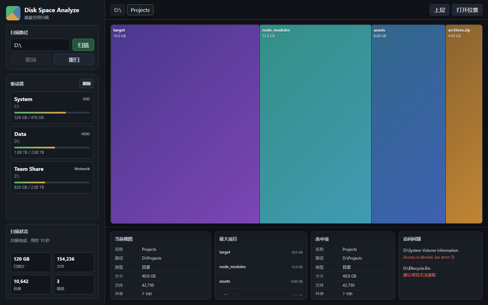

# Disk Space Analyze

[English](README.md) | [简体中文](README.zh-CN.md)


Disk Space Analyze is a lightweight desktop disk usage visualizer built with Rust and Tauri 2. It scans local disks or mapped network drives such as `Z:\`, then renders a SpaceSniffer-like treemap so you can quickly find large folders and files.

The app runs locally. It does not upload file names, paths, or scan results.

## Screenshots

The screenshots below use demo data.





## Features

- Scan local drives, removable drives, mapped network drives, or any manually entered directory path.
- Visualize disk usage with a clickable treemap.
- Drill into folders and navigate back with breadcrumbs.
- Show file count, folder count, total size, scan progress, and access error samples.
- Cancel a running scan.
- Reveal the selected file or folder in Windows Explorer.
- Skip symbolic links and junctions to avoid recursive loops and duplicate counting.
- Compact very large directories by keeping the largest entries and merging tiny entries into an aggregate node.

## Requirements

- Windows 10/11
- Rust stable toolchain
- Tauri 2 system dependencies:
  - Microsoft C++ Build Tools
  - Microsoft Edge WebView2 Runtime

If `cargo` is installed but not available in your terminal, use the full path, for example:

```powershell
C:\Users\<you>\.cargo\bin\cargo.exe --version
```

## Quick Start

Clone the repository and run the app:

```powershell
cargo run --manifest-path .\src-tauri\Cargo.toml
```

Or run it with the Tauri CLI:

```powershell
cargo install tauri-cli --version "^2"
cargo tauri dev
```

## Build

Create a release build:

```powershell
cargo build --release --manifest-path .\src-tauri\Cargo.toml
```

The application binary is generated at:

```text
target\release\disk-space-analyze.exe
```

## Package

Create a single Windows NSIS installer:

```powershell
cargo tauri build --bundles nsis
```

The installer is generated at:

```text
target\release\bundle\nsis\Disk Space Analyze_0.1.0_x64-setup.exe
```

## Usage

1. Launch the app.
2. Select a drive from the sidebar or type a path such as `C:\`, `D:\Projects`, or `Z:\`.
3. Click **扫描**.
4. Click a directory rectangle to drill down.
5. Use breadcrumbs or **上层** to navigate back.
6. Select an item and click **打开位置** to open it in Windows Explorer.

## Project Structure

```text
.
├── docs/
│   └── images/              # README screenshots
├── src-tauri/
│   ├── capabilities/        # Tauri command permissions
│   ├── icons/               # Windows app icon
│   ├── permissions/         # Custom Tauri permission manifest
│   ├── src/main.rs          # Rust scanning backend and Tauri commands
│   ├── Cargo.toml
│   └── tauri.conf.json
├── ui/
│   ├── app.js               # Treemap UI and Tauri IPC glue
│   ├── index.html
│   └── styles.css
├── Cargo.toml               # Workspace manifest
└── README.md
```

## Architecture

The app is split into a native scanning backend and a static frontend:

- `src-tauri/src/main.rs`
  - lists available roots and mapped drives
  - scans directories on a background thread
  - emits progress and completion events to the UI
  - exposes commands for cancellation and Explorer reveal
- `ui/app.js`
  - invokes Tauri commands
  - listens for scan events
  - renders the treemap, breadcrumbs, metrics, and detail panels

## Notes

- Scanning a whole system drive or a slow network drive can take time.
- Some protected folders may fail with access denied errors; these are counted and shown in the access issues panel.
- The reported size is based on file byte length, not physical allocation size on disk.
- The app currently focuses on Windows. Other platforms may need small adjustments around drive enumeration and file manager reveal behavior.

## Roadmap

- Export scan reports as JSON or HTML.
- Add search/filter inside scan results.
- Add file extension statistics.
- Add optional physical allocation size mode.
- Add persistent scan history.

## Contributing

Issues and pull requests are welcome. For larger changes, open an issue first so the implementation direction can be discussed.

Before submitting a change, run:

```powershell
cargo fmt --manifest-path .\src-tauri\Cargo.toml
cargo check --manifest-path .\src-tauri\Cargo.toml
```

## License

This project is licensed under the GNU General Public License v3.0 only. See [LICENSE](LICENSE) for details.
